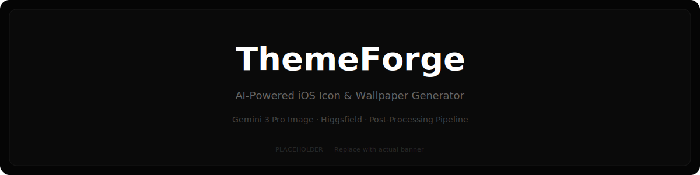

<p align="center">
  
</p>

<h1 align="center">ThemeForge</h1>

<p align="center">
  <strong>AI-powered iOS icon & wallpaper generator with post-processing pipeline</strong>
</p>

<p align="center">
  <a href="#features">Features</a> •
  <a href="#architecture">Architecture</a> •
  <a href="#quick-start">Quick Start</a> •
  <a href="#usage">Usage</a> •
  <a href="#post-processing">Post-Processing</a> •
  <a href="#providers">Providers</a> •
  <a href="#focus-modes">Focus Modes</a> •
  <a href="#faq">FAQ</a> •
  <a href="#contributing">Contributing</a>
</p>

<p align="center">
  
  
  
  
  
</p>

---

## What is ThemeForge?

ThemeForge takes a screenshot of your iPhone home screen (or a manual app list), detects every app, generates AI-themed icons and wallpapers using Gemini 2.5 Flash / Gemini 3 Pro Image / Higgsfield, post-processes them with iOS-accurate superellipse corners and sharpening, then packages everything into a downloadable zip with a manifest and step-by-step setup guide.

Built for the 10% of iPhone users who actually care about how their home screen looks.

<p align="center">
  
</p>

---

## Features

### Core Pipeline

| Step            | What Happens                                                                                                             |
| --------------- | ------------------------------------------------------------------------------------------------------------------------ |
| **1. Setup**    | Enter API key, choose provider (Gemini or Higgsfield), select Gemini model (2.5 Flash / 3 Pro), set icon size (180/512/1024px), toggle post-processing |
| **2. Detect**   | Upload screenshot → AI Vision (Gemini / OpenAI / Anthropic) identifies all apps, OR manually enter/pick from 60+ quick-select apps |
| **3. Theme**    | Choose from 7 presets (Minimal B&W, Dark Glyph, Outline Mono, Neo Brutal, Soft Ink, Light Mode) or write a custom prompt |
| **4. Generate** | AI generates individual icons per app + 2 matching wallpapers. Progress tracked per-icon with retry queue for failures   |
| **5. Download** | Preview all icons, download individually or as a zip containing icons/, wallpapers/, manifest.json, and SETUP_GUIDE.md   |

### Post-Processing Pipeline

Every generated icon passes through three stages before export:

```
Raw AI Output → Square Crop → iOS Superellipse Corners → Unsharp Mask Sharpen → Final PNG
```

- **Square crop**: Centers and crops non-square outputs to 1:1
- **iOS corners**: Superellipse curve at 22.37% radius ratio (matches Apple's actual corner geometry, not CSS border-radius)
- **Sharpening**: Pixel-level unsharp mask to add crispness without artifacts

Can be toggled off for raw output.

### Focus Mode Integration

- Assign apps to **Work** or **Home** buckets during the theme step
- Manifest JSON maps each app → icon file → URL scheme → focus mode
- Setup guide includes exact steps for configuring iOS Focus Mode auto-switching by time/location

### Dual Provider Support

| Provider       | Model                                           | Speed        | Cost                | Best For                              |
| -------------- | ----------------------------------------------- | ------------ | ------------------- | ------------------------------------- |
| **Gemini**     | gemini-2.5-flash (Nano Banana)                   | ~3-5s/icon   | Free tier available | Default, fast iteration               |
| **Gemini**     | gemini-3-pro-image (Nano Banana Pro)             | ~3-5s/icon   | Free tier available | Higher quality generation             |
| **Higgsfield** | Queue-based (Nano Banana Pro, Seedream, FLUX 2) | ~10-30s/icon | Credit-based        | Higher resolution, alternative styles |

---

## Architecture

```
┌─────────────────────────────────────────────────────────┐
│                    ThemeForge App                        │
├─────────────┬──────────────┬──────────────┬─────────────┤
│   Upload /  │  App         │  Theme       │  Download   │
│   API Keys  │  Detection   │  Selection   │  & Package  │
├─────────────┴──────┬───────┴──────────────┴─────────────┤
│                    │                                     │
│  ┌─────────────────▼──────────────────┐                 │
│  │        Generation Engine           │                 │
│  │  ┌──────────┐  ┌────────────────┐  │                 │
│  │  │  Gemini  │  │  Higgsfield    │  │                 │
│  │  │  Direct  │  │  Queue-based   │  │                 │
│  │  └────┬─────┘  └───────┬────────┘  │                 │
│  │       └────────┬───────┘           │                 │
│  │                ▼                   │                 │
│  │     ┌──────────────────┐          │                 │
│  │     │ Post-Processing  │          │                 │
│  │     │ • Square crop    │          │                 │
│  │     │ • iOS corners    │          │                 │
│  │     │ • Sharpen        │          │                 │
│  │     └────────┬─────────┘          │                 │
│  └──────────────┼────────────────────┘                 │
│                 ▼                                       │
│  ┌──────────────────────────────┐                      │
│  │       Zip Packager           │                      │
│  │  icons/ + wallpapers/        │                      │
│  │  manifest.json               │                      │
│  │  SETUP_GUIDE.md              │                      │
│  └──────────────────────────────┘                      │
└─────────────────────────────────────────────────────────┘
```

---

## Quick Start

### Prerequisites

- A **Google Gemini API key** — [Get one free here](https://aistudio.google.com/apikey)
- Optionally: A **Higgsfield API Key ID + Secret** — [cloud.higgsfield.ai](https://cloud.higgsfield.ai)
- Optionally: An **OpenAI API key** (for GPT-4o screenshot detection) — [platform.openai.com](https://platform.openai.com)
- Optionally: An **Anthropic API key** (for Claude screenshot detection) — [console.anthropic.com](https://console.anthropic.com)

### Option 1: Run on Claude.ai

1. Copy the entire React component from `src/ThemeForge.tsx`
2. Paste into a Claude.ai artifact (React type)
3. Enter your API key in the app
4. Start generating

### Option 2: Run Locally

```bash
# Clone the repo
git clone https://github.com/MrHalder/themeforge.git
cd themeforge

# Install dependencies
npm install

# Start dev server
npm run dev
```

### Option 3: Deploy to Vercel

[](https://vercel.com/new/clone?repository-url=https://github.com/MrHalder/themeforge)

> **Note**: API keys are entered client-side and never stored on any server.
> They exist only in your browser session memory.

---

## Usage

### Screenshot Detection Mode

1. Take a screenshot of your iPhone home screen
2. Upload it to ThemeForge
3. Gemini Vision will identify all visible apps
4. Review and edit the detected list (add/remove apps)

### Manual Entry Mode

1. Type app names separated by commas, or
2. Click quick-pick buttons for 60+ popular apps including:
   - System: Phone, Messages, Mail, Safari, Camera, Photos, Maps, etc.
   - Social: Instagram, WhatsApp, Twitter/X, Threads, Snapchat, TikTok
   - Productivity: Slack, Notion, Zoom, Microsoft Teams, Outlook
   - India-specific: Swiggy, Zomato, PhonePe, GPay, CRED, Groww, Zerodha, Ola, Rapido

### Theme Presets

| Preset       | Description                         |
| ------------ | ----------------------------------- |
| Minimal B&W  | Clean white line icons on black     |
| Dark Glyph   | Solid white filled symbols on black |
| Outline Mono | White outlined icons on black       |
| Neo Brutal   | Bold chunky geometric B&W shapes    |
| Soft Ink     | Hand-drawn ink illustration style   |
| Light Mode   | Black symbols on white              |
| Custom       | Write your own prompt               |

### Custom Prompt Tips

Be specific about:

- **Background**: "pure black background" or "white background"
- **Style**: "line art", "filled glyph", "geometric", "hand-drawn"
- **Constraints**: "no text", "no gradients", "single color"
- **Format**: "iOS app icon style", "square format", "centered"

Example:

```
glassmorphism style icon, frosted translucent white glass on dark background,
subtle white border, soft inner glow, centered minimal symbol, no text,
iOS app icon, square
```

---

## Post-Processing

### iOS Superellipse Corners

Standard CSS `border-radius` creates circular corners. iOS uses a **continuous superellipse** (squircle) — a mathematically different curve that creates smoother, more organic corners.

```
Standard border-radius:     iOS superellipse:
    ╭──────╮                   ╭──────╮
    │      │                  ╱        ╲
    │      │                 │          │
    │      │                 │          │
    ╰──────╯                  ╲        ╱
                               ╰──────╯
    (circular arc)          (continuous curve)
```

ThemeForge approximates the iOS curve using cubic bezier paths at a **22.37% radius ratio** — matching Apple's actual implementation.

### Sharpening

AI-generated icons at 512px tend to be slightly soft. The unsharp mask pass:

1. Computes a blur estimate per pixel (4-neighbor average)
2. Amplifies the difference between original and blur
3. Applies at 30% intensity — enough for crispness, no haloing

### Toggle

Post-processing can be disabled entirely via the toggle in Setup. Raw AI output will be exported as-is.

---

## Providers

### Google Gemini (Recommended)

- **Detection model**: `gemini-2.5-flash` (vision)
- **Generation models** (selectable in Setup):
  - `gemini-2.5-flash` — "Nano Banana" · Up to 32.8K input / 8.2K output tokens
  - `gemini-3-pro-image` — "Nano Banana Pro" · Higher quality generation
- **Rate limits**: Free tier ~10-15 RPM, up to 500 requests/day
- **Output**: Base64 PNG inline

```
API Flow: prompt → generateContent → base64 PNG in response
Latency: ~3-5 seconds per icon
```

### Higgsfield (Alternative)

- **Base URL**: `platform.higgsfield.ai`
- **Auth**: Two-part key — API Key ID + API Key Secret (header: `Key {id}:{secret}`)
- **Model**: `higgsfield-ai/soul/standard` (flagship text-to-image)
- **Architecture**: Queue-based async (submit → poll → result)
- **Output**: URL to generated image

```
Auth: Key {api_key_id}:{api_key_secret}
API Flow: POST /{model_id} → request_id → GET /requests/{id}/status → completed → image URL
Latency: ~10-30 seconds per icon (queue dependent)
```

> **Note**: Higgsfield requires a paid plan. API Key ID and Secret are provided in your dashboard at [cloud.higgsfield.ai](https://cloud.higgsfield.ai).

### Detection Providers

Screenshot app detection supports three AI providers (selectable in Setup when using screenshot mode):

| Provider       | Model                    | API Key          | Notes                                                    |
| -------------- | ------------------------ | ---------------- | -------------------------------------------------------- |
| **Gemini**     | gemini-2.5-flash (vision)| Gemini API key   | Default. Same key used for generation if Gemini selected |
| **OpenAI**     | GPT-4o (vision)          | OpenAI API key   | Detection only. Requires separate key                    |
| **Anthropic**  | Claude Sonnet 4.5 (vision)| Anthropic API key| Detection only. Uses browser CORS header                 |

Detection provider is independent of generation provider — you can use OpenAI for detection + Gemini for generation, etc.

### Detection History (IndexedDB)

ThemeForge persists every detection session locally using IndexedDB:

- **Stored per session**: timestamp, screenshot, detection provider, detected apps, selected apps, unchecked apps
- **History view**: Collapsible table in Setup showing past sessions with counts
- **Stats**: Total uploads, total apps detected, total apps unchecked across all sessions
- **Privacy**: All data stays in your browser's IndexedDB. Nothing is sent to any server.

---

## Focus Modes

ThemeForge generates a complete Focus Mode setup in every zip:

### How It Works on iOS

1. **Work Mode** — Shows only work-related apps on a dedicated home screen page
2. **Home Mode** — Shows personal/entertainment apps on a separate page
3. **Auto-switching** — iOS Focus can trigger by:
   - **Time**: Mon-Fri 9am-6pm = Work
   - **Location**: Office WiFi/GPS = Work, Home = Personal
   - **Smart Activation**: iOS learns your patterns

### manifest.json Structure

```json
{
  "version": "2.0",
  "theme": "minimal-bw",
  "provider": "gemini",
  "iconSize": 512,
  "postProcessed": true,
  "modes": {
    "work": [
      {
        "app": "Slack",
        "icon": "icons/Slack.png",
        "urlScheme": "slack://"
      }
    ],
    "home": [
      {
        "app": "Instagram",
        "icon": "icons/Instagram.png",
        "urlScheme": "instagram://"
      }
    ]
  }
}
```

### URL Schemes

ThemeForge ships with **90+ pre-mapped URL schemes** for popular apps. The manifest includes these for advanced users who want to build custom Shortcuts automations.

---

## Output Structure

```
themeforge_minimal-bw_512px_1738934400000.zip
├── icons/
│   ├── Instagram.png        (512×512, post-processed)
│   ├── WhatsApp.png
│   ├── Safari.png
│   ├── Slack.png
│   └── ... (one per selected app)
├── wallpapers/
│   ├── wallpaper_1.png      (portrait, matches theme)
│   └── wallpaper_2.png
├── manifest.json            (app→icon→URL scheme→mode mapping)
└── SETUP_GUIDE.md           (step-by-step iPhone setup instructions)
```

---

## Limitations

Being upfront about what this can and can't do:

| Limitation             | Why                                                       | Workaround                                                       |
| ---------------------- | --------------------------------------------------------- | ---------------------------------------------------------------- |
| No auto-apply icons    | iOS doesn't allow programmatic icon assignment            | Setup guide walks through manual Shortcuts method (~1 min/icon)  |
| Shortcut banner flash  | Custom icons via Shortcuts briefly show the Shortcuts app | Use iOS Focus Mode pages to minimize friction                    |
| No notification badges | Shortcut-created icons don't show badge counts            | Keep App Library accessible for badge-critical apps              |
| AI consistency         | Icons in a batch may have slight style variations         | Regenerate individual icons, or use more specific custom prompts |
| Rate limits            | Free Gemini tier caps at ~15 requests/minute              | Built-in 1.5s delay between calls; paid tier removes limits      |

---

## Project Structure

```
themeforge/
├── public/
│   └── vite.svg
├── src/
│   ├── App.tsx               # App wrapper
│   ├── db.ts                 # IndexedDB persistence layer
│   ├── main.tsx              # React entry point
│   ├── ThemeForge.tsx        # Main app component (single-file)
│   └── vite-env.d.ts         # Vite type declarations
├── assets/
│   ├── themeforge-banner.svg
│   ├── demo-flow.svg
│   └── screenshots/
│       ├── step-1-setup.svg
│       ├── step-2-detect.svg
│       ├── step-3-theme.svg
│       ├── step-4-generate.svg
│       └── step-5-download.svg
├── index.html
├── package.json
├── tsconfig.json
├── vite.config.ts
├── eslint.config.js
├── README.md
├── LICENSE
└── .gitignore
```

---

## Roadmap

- [ ] Batch retry with alternative prompts for failed icons
- [ ] Icon style preview before full generation (generate 1 sample first)
- [ ] SVG export option (trace PNG → vector)
- [ ] Widget generation (Widgetsmith compatible)
- [ ] Shortcut file (.shortcut) generator for semi-automated setup
- [ ] Community theme gallery (share/import theme presets)
- [ ] Android support (Material You icon shapes)

---

## FAQ

**Q: Do I need all the API keys?**
No. You need a **generation provider key** (Gemini or Higgsfield) and a **detection provider key** (Gemini, OpenAI, or Anthropic) only if you're using screenshot detection. Manual app entry requires no detection key. You can mix providers — e.g., OpenAI for detection + Gemini for generation.

**Q: Are my API keys stored anywhere?**
No. Keys exist only in your browser's session memory (React state). They're never saved to localStorage, cookies, or any server. They're sent directly to the respective APIs via HTTPS. Detection history (screenshots, app lists) is stored locally in your browser's IndexedDB — never uploaded.

**Q: How much does generation cost?**
With Gemini's free tier: $0 for small batches (~15 icons). At scale, Gemini API pricing applies per token. A typical 25-icon set + 2 wallpapers costs pennies.

**Q: Why not use iOS 18's built-in dark/tinted icons?**
iOS 18's tinting only changes the icon's background shade and applies a color filter. ThemeForge generates entirely new icon designs — different symbols, different art styles, completely custom aesthetics. Different league.

**Q: Can I use this for Android?**
The icon generation works for any platform. The post-processing currently applies iOS superellipse corners. Android support (squircle/teardrop/circle shapes) is on the roadmap.

**Q: The generated icons don't look consistent — what do I do?**
Add more specificity to your prompt. Include exact details like "2px white stroke on pure #000000 background" rather than "minimal style." You can also regenerate individual icons that don't match.

---

## Contributing

Contributions welcome. Particularly interested in:

1. **More URL schemes** — If you know an app's URL scheme that's not mapped, submit a PR
2. **Theme presets** — Create and share new preset prompts that produce consistent results
3. **Post-processing improvements** — Better superellipse approximation, adaptive sharpening
4. **Provider integrations** — DALL-E, Stable Diffusion, Midjourney API support

```bash
# Fork → Clone → Branch → Commit → PR
git checkout -b feature/your-feature
```

---

## License

MIT — do whatever you want with it.

---

<p align="center">
  Built for the 10% who care about their home screen.<br/>
  <sub>Star ⭐ if this saved you from manually Googling "aesthetic iOS icon pack" for 3 hours.</sub>
</p>
